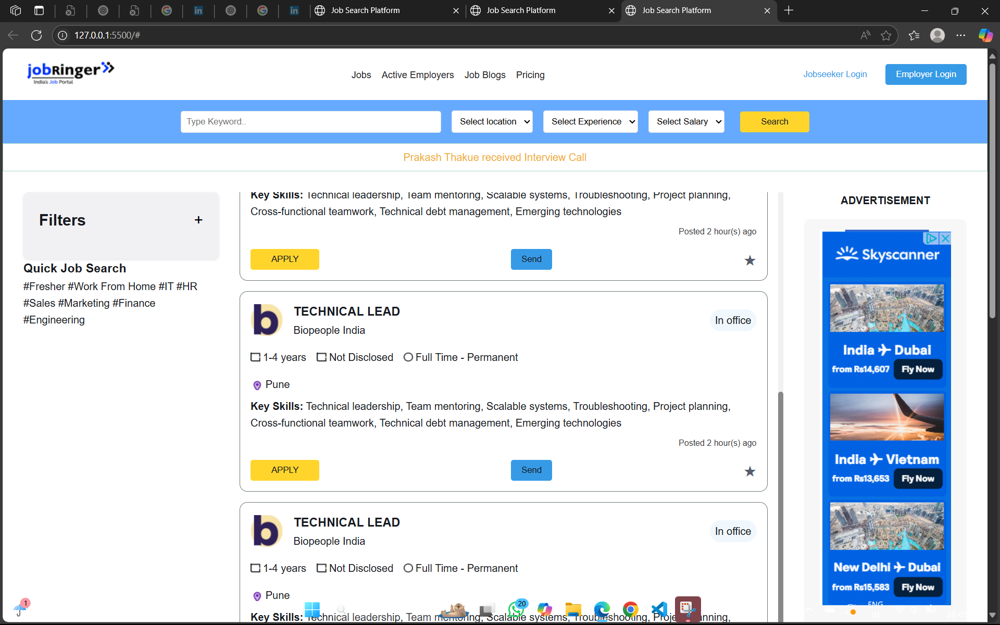

# Job Search Platform Assignment

This project is a simple job search platform front-end, built using HTML and CSS. It features a job listing page with filters, search functionality, and advertisements.

## Directory Structure

## Features

- Responsive header with navigation and login buttons
- Search bar for keywords, location, experience, and salary
- Filter sidebar for keywords, experience, work mode, and job type
- Quick job search tags
- Job listings with company logo, job details, and actions (apply, send, bookmark)
- Advertisement sections (right sidebar and bottom)
- Footer with stats, links, social icons, and recognition

## How to Use

1. Clone the repository:
2. Open the project folder in your code editor.
3. Open `index.html` in your browser to view the job search platform.

## Screenshots

## Credits

- All images and logos are for representation purposes only.
- Built as part of a front-end assignment.

---
© 2023 Jobringer. All rights reserved.